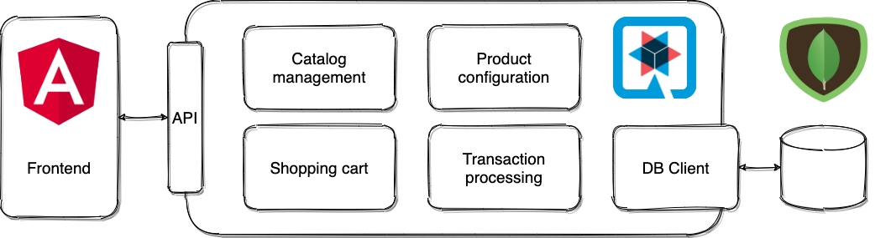

# ecommerce

This project provides a ecommerce platform based on Quarkus.



# Installation

## Packaging and running the application

The application can be packaged using:
```shell script
./mvnw package
```
It produces the `ecommerce-1.0.0-SNAPSHOT-runner.jar` file in the `/target` directory.
Be aware that it?s not an _?ber-jar_ as the dependencies are copied into the `target/lib` directory.
If you want to build an _?ber-jar_, just add the `--uber-jar` option to the command line:
```shell script
./mvnw package -PuberJar
```

The application is now runnable using `java -jar target/ecommerce-1.0.0-SNAPSHOT-runner.jar`.

## Creating a native executable

You can create a native executable using:
```shell script
./mvnw package -Pnative
```

Or, if you don't have GraalVM installed, you can run the native executable build in a container using:
```shell script
./mvnw package -Pnative -Dquarkus.native.container-build=true
```

You can then execute your native executable with: `./target/ecommerce-1.0.0-SNAPSHOT-runner`

# Usage

If you run the application locally you can access the OpenAPI documentation with localhost:8080/openapi and test the API with localhost:8080/swagger-ui.

# Support

If you find a bug or have suggestions for improvements, please open an issue.

# Roadmap

## Release One

* Catalog management
* Product configuration
* Shopping cart
* Transaction processing

# Contributing

Pull requests are welcome. For major changes, please open an issue first to discuss what you would like to change.

Please make sure to update tests as appropriate.

## Running the application in dev mode

You can run your application in dev mode that enables live coding using:
```shell script
./mvnw compile quarkus:dev
```

# Authors and acknowledgment

The start of this project was the idea of creating an ecommerce platfrom for self-sewn products by my wife.

# License

[GNU GENERAL PUBLIC LICENSE](./LICENSE)

# Project status

The project is still in development.
